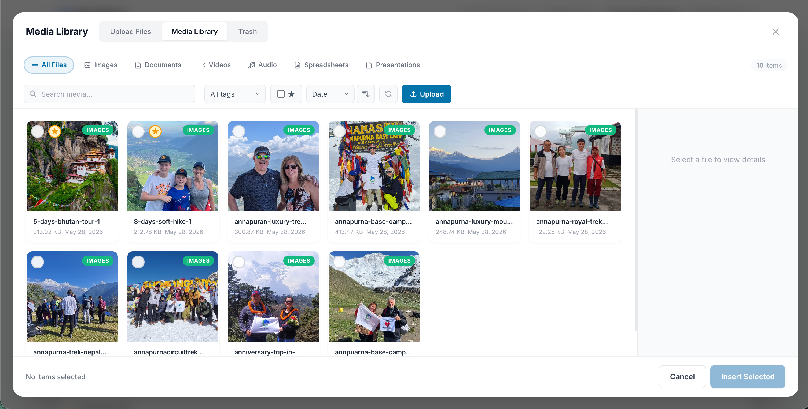

# File Picker

A powerful media library and file picker component for Laravel Livewire. Supports images, videos, audio, documents, and every other file type, all behind a polished modal interface.



## Features

- 📁 **All file types** — images, videos, audio, documents, spreadsheets, presentations, archives, code
- 🎨 **Clean, themeable UI** — fully recolorable through config, with a responsive sheet-style detail panel on tablet/mobile
- 🔍 **Search & filter** — by file type, folder, tag, or favorite
- 📤 **Drag & drop + paste** — drop files in, or paste straight from the clipboard
- 🚨 **Upload error reporting** — per-file validation messages, browser-side failures (413/network) surface in the same toast
- ✅ **Single / multiple selection** — with a configurable `max_files`
- 🗑️ **Trash & restore** — soft-delete with retention-based pruning
- 🔁 **Replace file** — swap the file behind a media row without changing its ID
- 🪪 **Hash & duplicate detection** — SHA-256 dedup with `reuse`, `reject`, or `allow` strategies
- ⭐ **Favorites, 🏷️ tags, 📂 folders** — organize without inventing your own taxonomy
- ✏️ **Inline editing** — rename and edit alt text without leaving the picker
- 👤 **Ownership tracking** — auto-record `user_id`, optionally scope per user
- 📊 **Storage quotas** — global and per-user
- 📈 **Statistics API** — counts, sizes, by-type via `FilePicker::getStats()`
- 📥 **Downloads** — single files or bulk ZIP
- 🛠️ **Console commands** — `file-picker:prune-trash`, `file-picker:prune-orphans`, `file-picker:stats`
- 🎯 **Form integration** — Livewire components and traditional HTML forms
- ♿ **Accessible** — keyboard nav, focus management, Esc to close

## Requirements

- PHP 8.2+
- Laravel 11.x, 12.x, or 13.x
- Livewire 3.x or 4.x
- [`plank/laravel-mediable`](https://github.com/plank/laravel-mediable) ^6.0 — installed automatically

## Installation

```bash
composer require anil/file-picker
php artisan file-picker:install
```

`file-picker:install` publishes `config/file-picker.php` and runs an **additive** migration that adds the columns the package needs (`folder`, `tags`, `is_favorite`, `hash`, `width`, `height`, `duration`, `user_id`, `download_count`, `custom_properties`, `deleted_at`) to Plank's existing `media` table. CSS/JS are served via a built-in route — nothing to publish, nothing to compile.

### Install command flags

```bash
php artisan file-picker:install --force         # overwrite already-published files
php artisan file-picker:install --no-migrate    # publish only, skip migrations
php artisan file-picker:install --views         # publish blade views for UI overrides
php artisan file-picker:install --lang          # publish language files
php artisan file-picker:install --assets        # publish CSS/JS to public/ (optional)
```

### Add stack slots to your layout

The component pushes CSS to `@stack('head')` and JS to `@stack('scripts')`:

```blade
<!DOCTYPE html>
<html>
<head>
    @stack('head')
</head>
<body>
    {{ $slot }}
    @stack('scripts')
</body>
</html>
```

## Quick Start

```blade
{{-- Single file --}}
<livewire:file-picker input-name="featured_image" />

{{-- Multiple files, up to 5 --}}
<livewire:file-picker input-name="gallery" :multiple="true" :max-files="5" />

{{-- Restrict to specific file types --}}
<livewire:file-picker input-name="avatar" :allowed-types="['image']" />
```

## Usage

### In a Livewire component

```php
namespace App\Livewire;

use Livewire\Attributes\On;
use Livewire\Component;

class PostForm extends Component
{
    public array $selectedMedia = [];

    #[On('filesSelected')]
    public function handleFilesSelected(array $selected, string $inputName): void
    {
        // $selected is an array of media IDs
        $this->selectedMedia = $selected;
    }

    public function render()
    {
        return view('components.post-form');
    }
}
```

```blade
<div>
    <livewire:file-picker
        input-name="media"
        :multiple="true"
        :max-files="10"
        :selected="$selectedMedia"
        :allowed-types="['image', 'video']"
    />

    <p>Selected: {{ count($selectedMedia) }} files</p>
</div>
```

### In a traditional HTML form

```blade
<form id="my-form" action="/posts" method="POST">
    @csrf

    {{-- Single file — populates a hidden input --}}
    <livewire:file-picker input-name="featured_image" form-id="my-form" />

    {{-- Multiple files — auto-submit form after selection --}}
    <livewire:file-picker
        input-name="gallery[]"
        :multiple="true"
        :max-files="10"
        form-id="my-form"
        :auto-submit="true"
    />

    <button type="submit">Save</button>
</form>
```

### With a JavaScript callback

```blade
<livewire:file-picker input-name="media" callback-function="onMediaSelected" />

<script>
function onMediaSelected(selected, inputName, inputId) {
    console.log('Selected media:', selected);
}
</script>
```

## Component Properties

| Property           | Type     | Default   | Description                                    |
| ------------------ | -------- | --------- | ---------------------------------------------- |
| `multiple`         | `bool`   | `false`   | Allow multiple selection                       |
| `maxFiles`         | `int`    | `10`      | Maximum number of files that can be selected   |
| `selected`         | `array`  | `[]`      | Pre-selected media IDs                         |
| `allowedTypes`     | `array`  | `[]`      | Restrict to specific file types (empty = all)  |
| `inputName`        | `string` | `'files'` | Name for the hidden input(s)                   |
| `inputId`          | `string` | auto      | ID for the hidden input                        |
| `formId`           | `string` | `''`      | Form ID to target for auto-submit              |
| `autoSubmit`       | `bool`   | `false`   | Auto-submit the form after selection           |
| `callbackFunction` | `string` | `''`      | Global JS function name called after selection |
| `buttonLabel`      | `string` | auto      | Override the trigger button label              |
| `showPreview`      | `bool`   | `true`    | Show selected file previews below the button   |
| `perPage`          | `int`    | `24`      | Items per page in the media library            |

## Allowed File Types

Restrict the picker via `allowedTypes`:

```blade
<livewire:file-picker :allowed-types="['image', 'document']" />
```

| Type           | Extensions                                                          |
| -------------- | ------------------------------------------------------------------- |
| `image`        | jpg, jpeg, png, gif, webp, svg, bmp, ico, tiff, avif                |
| `video`        | mp4, webm, ogg, mov, avi, mkv, wmv, flv, m4v                        |
| `audio`        | mp3, wav, aac, ogg, flac, m4a, wma, aiff                            |
| `document`     | pdf, doc, docx, txt, rtf, odt, md, epub                             |
| `spreadsheet`  | xls, xlsx, csv, ods, numbers                                        |
| `presentation` | ppt, pptx, odp, key                                                 |
| `archive`      | zip, rar, 7z, tar, gz, bz2, xz                                      |
| `code`         | js, ts, php, html, css, json, yaml, vue, jsx, tsx, py, go, rs, etc. |

Extensions per type can be customised in `config/file-picker.php` under `extensions`.

## Events

### JavaScript event

Fired on `window` after the user confirms a selection:

```javascript
window.addEventListener('file-picker:selected', (event) => {
    const { selected, inputName, inputId } = event.detail;
    console.log('Selected media:', selected);
});
```

Each item in `selected` is an object with `id`, `url`, `filename`, `size`, `extension`, `file_type`, `alt`, `created_at`.

### Livewire events

Two events fire whenever the selection changes — pick the one that fits your handler shape:

**`filesSelected`** — named arguments, easiest for typed signatures:

```php
#[On('filesSelected')]
public function onFilesSelected(array $selected, string $inputName): void
{
    // $selected is an array of media IDs (int)
    // $inputName is the picker's `input-name` prop
    $this->selectedIds = $selected;
}
```

**`file-picker-selected`** — single array payload with the full picker context:

```php
#[On('file-picker-selected')]
public function onFilePickerSelected(array $payload): void
{
    // keys: selected, inputName, inputId, formId, multiple, autoSubmit, callbackFunction
    $this->selectedIds = $payload['selected'];
}
```

> If you have several pickers on one page, switch on `$inputName` to route the selection to the right property.

## Upload Errors

Upload problems are surfaced to the UI at three levels:

1. **Server-side validation** (size, mime type) — failures render as a toast plus a per-file list (`{filename}: {message}`).
2. **Per-file driver failures** — `DuplicateMediaException`, `StorageQuotaExceededException`, `UploadFailedException`, or any other `Throwable` thrown by the driver are aggregated into the toast (e.g. *"2 uploaded, 1 failed"*).
3. **Browser-side failures** — the bundled JS listens for `livewire-upload-error` and forwards the HTTP status:
    - `413` → *"the file is larger than the server allows"*
    - `422` → *"the file did not pass validation"*
    - other status codes → generic *"Upload failed (HTTP …)"*

Error toasts are sticky — dismiss with the `×` button or any new upload action.

To push your own error into the toast (e.g. from a custom driver):

```php
$this->setUploadError('Quota exceeded — contact your administrator.');
```

## Tablet & Mobile

The library tab uses a side-by-side layout on desktop (≥1025px) with the **Attachment Details** panel always visible. On tablet/mobile (≤1024px), the panel becomes a right-side sheet that's closed by default — tapping a thumbnail just selects it.

To open the details sheet on touch devices, tap the **edit icon** that sits next to the selection checkbox on each item. It promotes the item to the active selection (without toggling existing selections off) and slides the sheet in. The icon is hidden on desktop where the sidebar is always inline. Rename it via the `texts.view_details` config key (or the published lang file).

## Drivers

### Plank driver (default)

Built on top of [`plank/laravel-mediable`](https://github.com/plank/laravel-mediable) — installed automatically. The bundled `FilePickerMedia` model extends Plank's `Media` and the install migration adds the extra columns to Plank's existing `media` table.

```env
FILE_PICKER_DRIVER=plank
FILE_PICKER_DISK=public
FILE_PICKER_DIRECTORY=media
```

> **Using a non-public disk?** Plank's `mediable.allowed_disks` config defaults to `['public']`. Publish Plank's config (`php artisan vendor:publish --tag=mediable-config`) and add your disk to `allowed_disks`.

### Custom driver

Implement `Anil\LivewireFilePicker\Contracts\MediaDriverInterface` (or extend `Anil\LivewireFilePicker\Drivers\AbstractDriver`) and register the FQCN:

```php
// config/file-picker.php
'driver' => \App\Media\MyCustomDriver::class,
```

## Authorization

Default is "everything allowed." For real apps, plug in an authorization class:

```php
namespace App\Auth;

use Anil\LivewireFilePicker\Contracts\FilePickerAuthorizationInterface;

class MediaAuthorization implements FilePickerAuthorizationInterface
{
    public function canViewLibrary(): bool         { return auth()->check(); }
    public function canUpload(): bool              { return auth()->user()?->can('upload-media') ?? false; }
    public function canDelete(int $mediaId): bool  { return auth()->user()?->can('delete-media') ?? false; }
    public function canEditAlt(int $mediaId): bool { return auth()->check(); }
}
```

```php
// config/file-picker.php
'authorization_class' => \App\Auth\MediaAuthorization::class,
```

## Custom Filters

Add filter controls to the library toolbar in two parts:

**1. UI controls in config:**

```php
'ui' => [
    'custom_filters' => [
        [
            'name'        => 'tag',
            'label'       => 'Tag',
            'type'        => 'select',          // select | text | checkbox | date_range
            'placeholder' => 'All Tags',
            'options'     => ['' => 'All Tags', 'nature' => 'Nature', 'urban' => 'Urban'],
        ],
        [
            'name'  => 'featured',
            'label' => 'Featured Only',
            'type'  => 'checkbox',
        ],
    ],
    'custom_filter_class' => \App\Filters\MediaFilter::class,
],
```

**2. The filter class:**

```php
namespace App\Filters;

use Anil\LivewireFilePicker\Contracts\CustomFilter;
use Illuminate\Database\Eloquent\Builder;

class MediaFilter implements CustomFilter
{
    public function apply(Builder $query, array $filters): Builder
    {
        if (!empty($filters['tag']))      $query->where('tag', $filters['tag']);
        if (!empty($filters['featured'])) $query->where('featured', true);

        return $query;
    }
}
```

## Configuration

Publish the config to customise everything:

```bash
php artisan vendor:publish --tag=file-picker-config
```

Key sections:

```php
'driver' => env('FILE_PICKER_DRIVER', 'plank'),  // 'plank' | CustomDriver::class

'drivers' => [
    'plank' => [
        'model'      => FilePickerMedia::class,
        'disk'       => env('FILE_PICKER_DISK', 'public'),
        'directory'  => env('FILE_PICKER_DIRECTORY', 'media'),
        'visibility' => env('FILE_PICKER_VISIBILITY', 'public'),
    ],
],

'max_file_size' => env('FILE_PICKER_MAX_SIZE', 102400), // KB (default: 100 MB)

'defaults' => [
    'multiple'     => false,
    'max_files'    => 40,
    'per_page'     => 24,
    'show_preview' => true,
],

'sorting' => [
    'field'     => 'created_at', // created_at | filename | size | extension
    'direction' => 'desc',
],

'features' => [
    'upload'              => true,
    'delete'              => true,
    'bulk_delete'         => true,
    'edit_alt'            => true,
    'rename'              => true,
    'search'              => true,
    'filter'              => true,
    'sorting'             => true,
    'drag_drop'           => true,
    'refresh'             => true,
    'keyboard_navigation' => true,
    'paste_upload'        => true,
],

'ui' => [
    'modal_style'        => 'fullscreen',         // 'fullscreen' | 'centered'
    'thumbnail_height'   => 150,
    'show_type_badges'   => true,
    'show_file_size'     => true,
    'show_date'          => true,

    'colors' => [
        'primary'       => '#0073aa',
        'primary_hover' => '#005a87',
        'danger'        => '#ef4444',
        'success'       => '#10b981',
        'warning'       => '#f59e0b',
    ],

    'font_family'        => "'Inter', sans-serif",
    'border_radius'      => 8,
    'grid_min_width'     => 160,
    'grid_gap'           => 14,
    'sidebar_width'      => 300,
    'backdrop_blur'      => 12,
    'backdrop_opacity'   => 0.6,
    'z_index'            => 9999,

    'filter_types'        => ['image', 'document', 'video', 'audio', 'spreadsheet', 'presentation'],
    'custom_filters'      => [],
    'custom_filter_class' => '',
],

'route_middleware' => ['web'],
```

### Text strings

All UI text is configurable. Publish lang files to translate:

```bash
php artisan file-picker:install --lang
```

```php
'texts' => [
    'modal_title'        => 'Media Library',
    'tab_upload'         => 'Upload Files',
    'tab_library'        => 'Media Library',
    'drop_zone'          => 'Drop files here or click to upload',
    'search_placeholder' => 'Search media...',
    'no_items'           => 'No media found',
    'insert_button'      => 'Insert Selected',
    'delete_confirm'     => 'Are you sure you want to delete this file?',
    'view_details'       => 'View details',     // tablet/mobile edit-icon label
    'sidebar_title'      => 'Attachment Details',
    'close_details'      => 'Close details',
    // ... see config/file-picker.php for the full list
],
```

## Customising Views

Publish blade views to override the UI:

```bash
php artisan file-picker:install --views
```

Views are published to `resources/views/vendor/file-picker/`.

## API Reference

### Component methods

| Method                              | Description                                     |
| ----------------------------------- | ----------------------------------------------- |
| `openModal()` / `closeModal()`      | Open / close the modal                          |
| `setViewMode('library'\|'trash')`   | Switch between active library and trash         |
| `toggleSelection($id)`              | Toggle selection of a media item                |
| `viewDetails($id)`                  | Promote item to active and open details panel   |
| `clearSelection()`                  | Clear all selected items                        |
| `insertSelected()`                  | Confirm selection and close modal               |
| `uploadFiles()`                     | Upload pending files                            |
| `setUploadError($message)`          | Push an error message into the upload toast    |
| `deleteMedia($id)`                  | Soft-delete (move to trash)                     |
| `restoreMedia($id)`                 | Restore from trash                              |
| `forceDeleteMedia($id)`             | Permanently delete (and remove file from disk) |
| `bulkDelete($ids)`                  | Soft-delete many at once                        |
| `toggleFavorite($id)`               | Toggle favorite                                 |
| `addTag()` / `removeTag($id, $tag)` | Manage tags                                     |
| `startMoving($id)` + `saveMove()`   | Move to a folder                                |
| `bulkMoveToFolder($ids, $folder)`   | Move many at once                               |
| `startReplacing($id)`               | Replace the underlying file                     |
| `refreshMedia()`                    | Reload media items                              |
| `clearFilters()`                    | Reset search / type / folder / tag / favorite   |

### Facade

```php
use Anil\LivewireFilePicker\Facades\FilePicker;

FilePicker::upload($temporaryFile, ['folder' => 'reports', 'tags' => ['q1']]);
FilePicker::replaceFile($id, $newFile);
FilePicker::toggleFavorite($id);
FilePicker::addTag($id, 'archive-2024');
FilePicker::moveToFolder($id, 'archive/2024');
FilePicker::restore($id);
FilePicker::forceDelete($id);
FilePicker::getStats();          // counts, sizes, by_type, favorites_count, trashed_count
FilePicker::findByHash($sha256); // dedup lookups
```

### Console commands

```bash
php artisan file-picker:prune-trash --days=30 --dry-run
php artisan file-picker:prune-orphans --dry-run
php artisan file-picker:stats
```

### Download routes

| Route                                  | Purpose                        |
| -------------------------------------- | ------------------------------ |
| `GET /file-picker/download/{id}`       | Force-download a single file   |
| `GET /file-picker/download-zip?ids[]=` | Stream a zip of selected media |

### Computed properties

| Property             | Type     | Description                    |
| -------------------- | -------- | ------------------------------ |
| `selectedMediaItems` | `array`  | Full details of selected media |
| `hasSelection`       | `bool`   | Whether any items are selected |
| `selectionLabel`     | `string` | Human-readable selection count |
| `selectedCount`      | `int`    | Number of selected items       |

## License

The MIT License (MIT). See [License File](LICENSE.md).
